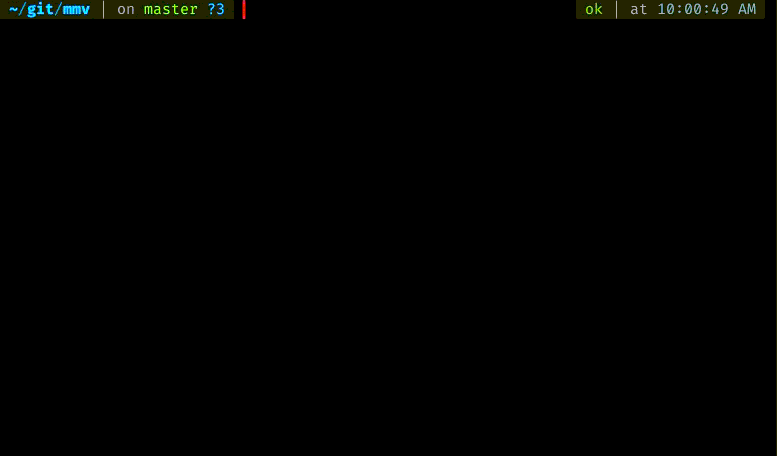

# mmv (Multi MoVe)

mmv is a terminal program that opens the given list of files as a file in a text editor (using `editor`, like crontab) and reads the file and moves them when the editor is closed.

**EDIT:** Oh wait, this package name is [already taken](https://packages.ubuntu.com/jammy/mmv)

